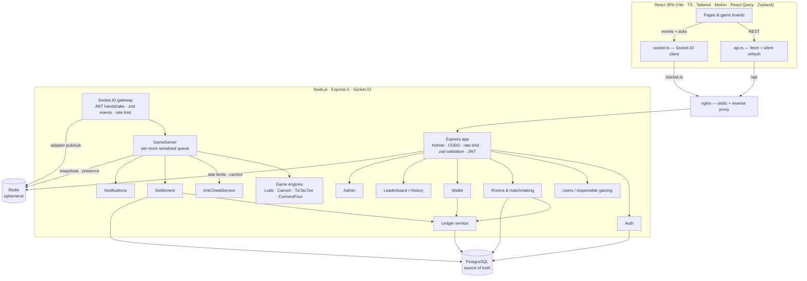
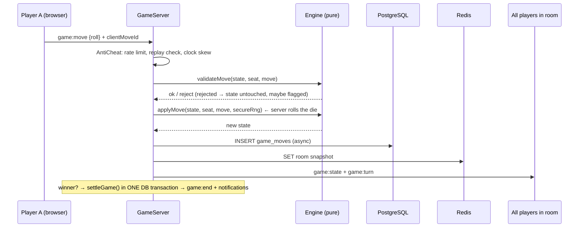

# 🎮 GameArena

[](https://render.com/deploy?repo=https://github.com/VardhanaHarsh/gamearena)

**A production-style, full-stack, real-time multiplayer gaming platform prototype** — Ludo, Carrom, Chess, Checkers, Tic-Tac-Toe and Connect Four, built on a modular server-authoritative game engine, a double-entry-style virtual-credit ledger, Socket.IO, PostgreSQL and Redis.

> ### ⚠️ This is a portfolio prototype that uses **virtual credits only**.
> Every player receives a one-time grant of **1,000 virtual credits**. Credits have **no monetary value**, cannot be purchased, sold, transferred or withdrawn, and there is **no payment, deposit or withdrawal integration of any kind**. It does not process real-money gambling transactions.

---

## Contents
1. [Features](#features) · 2. [Architecture](#architecture) · 3. [Tech stack](#tech-stack) · 4. [Folder structure](#folder-structure) · 5. [Quick start](#quick-start) · 6. [Database design](#database-design) · 7. [Authentication](#authentication) · 8. [Game engine](#game-engine) · 9. [WebSockets / multiplayer](#websockets--multiplayer-architecture) · 10. [Wallet & ledger](#wallet--ledger-architecture) · 11. [Security & anti-cheat](#security--anti-cheat) · 12. [Testing](#testing) · 13. [Docker](#docker) · 14. [Adding a new game](#adding-a-new-game) · 15. [Modifying game rules](#modifying-game-rules) · 16. [API reference](#api-reference)

---

## Features

| Area | What's implemented |
| --- | --- |
| **Games** | Ludo (2–4 players: dice, safe squares, captures, home column, exact-roll finish, bonus rolls, three-sixes rule), Carrom (deterministic server-side 2D physics, queen & cover rule, fouls, scoring), Chess (full rules: castling, en passant, promotion, check/mate, stalemate, threefold, 50-move, insufficient material, resignation), Checkers (compulsory captures, multi-jumps, crowning, kings, 40-move draw, resignation), Tic-Tac-Toe, Connect Four. |
| **Multiplayer** | Socket.IO rooms, ready/unready, host start, auto-start when full, 5-second countdown, turn timers with auto-play, invites by username + share link, reconnect with grace period, forfeit on abandonment, practice mode vs server bots, quick-match. |
| **Room lifecycle** | `WAITING → READY → STARTING → IN_PROGRESS → COMPLETED / CANCELLED` |
| **Wallet** | 1,000-credit welcome grant (once per account, idempotent), entry-fee **hold → capture / release**, prizes, refunds, draw splits, available vs locked balances, full ledger view. |
| **Accounts** | Register, login, logout, rotating refresh tokens, forgot/reset password, profile (display name, avatar, phone), levels/XP. |
| **Competition** | Global, weekly and per-game leaderboards; player profiles with win-rate ring, per-game stats, recent form; game history with full move log, settlement and ledger lines. |
| **Responsible gaming** | Session timer, break reminders, server-enforced daily virtual spending limit, self-pause (1–30 days). |
| **Notifications** | Persisted + real-time: player joined, invite, game starting, won/lost/draw, prize credited, refund, player disconnected/reconnected. |
| **Admin** | Overview KPIs, system health, ledger reconciliation, charts (games/day, players/day, popularity, credit volume), user management + suspension, live room monitor with cancel & refund, game enable/disable, transaction audit, result audit, anti-cheat flags, system logs. |
| **UX** | Dark (default) / light mode, synthesized sound effects with ON/OFF, Framer Motion transitions, responsive down to 360px, always-visible DEMO MODE banner, dev-only "Demo tools" quick-login toggle. |

---

## Architecture



**Move lifecycle (server-authoritative):**



---

## Tech stack

| Layer | Choice |
| --- | --- |
| Frontend | React 19, TypeScript, Vite, Tailwind CSS v4, Motion (Framer Motion), TanStack React Query, Zustand, Socket.IO client, React Router, Lucide icons |
| Backend | Node.js 22, TypeScript, Express 5, Socket.IO 4 (+ Redis adapter), zod, pino |
| Auth | JWT access tokens (15 min, in memory), rotating refresh tokens (httpOnly cookie, hashed in DB, reuse detection), Argon2id |
| Data | PostgreSQL 17 (all records, ledger), Redis 7 (presence, room snapshots, rate limits, caches, matchmaking locks) |
| Infra | Docker, Docker Compose, nginx |
| Tests | Vitest, Supertest, socket.io-client |

---

## Folder structure

```
gamearena/
├── docker-compose.yml          # postgres · redis · backend · frontend
├── .env.example                # copy to .env (never commit .env)
├── database/
│   ├── migrations/001_initial_schema.sql
│   └── seed/demo-data.json     # demo players and completed games
├── backend/
│   ├── Dockerfile
│   ├── src/
│   │   ├── app.ts · server.ts
│   │   ├── config/env.ts       # zod-validated env; refuses to start unless DEMO_MODE=true
│   │   ├── database/           # pool + transactions, migration runner, seed
│   │   ├── redis/client.ts
│   │   ├── middleware/         # auth (JWT/RBAC), validate (zod), rateLimit (Redis), errorHandler
│   │   ├── websocket/          # index.ts (Socket.IO gateway) · gameServer.ts (authoritative runtime)
│   │   ├── lib/                # errors, logger, secure random
│   │   └── modules/
│   │       ├── auth/  users/  wallet/  ledger/  rooms/ (+ settlement)
│   │       ├── games/          # engine.ts (interface) · registry.ts · rng.ts · engines/*.engine.ts
│   │       ├── leaderboard/  history/  notifications/  admin/  anticheat/  audit/
│   └── tests/                  # engines · ledger · settlement · api · multiplayer
└── frontend/
    ├── Dockerfile · nginx.conf
    └── src/
        ├── pages/              # Landing, Auth, Lobby, Games, Room, Wallet, History, Leaderboard, Profile, Account, Admin
        ├── games/              # ludo/ carrom/ ticTacToe/ connectFour/ + registry.ts
        ├── components/  hooks/  services/ (api, socket, sound)  store/ (auth, ui)  types/
```

---

## Quick start

**Prerequisites:** Node.js 22+, Docker with Compose.

```bash
cd gamearena
cp .env.example .env
# put two random secrets in .env:
#   JWT_ACCESS_SECRET=$(openssl rand -base64 48)
#   JWT_REFRESH_SECRET=$(openssl rand -base64 48)

docker compose up -d postgres redis        # databases only

cd backend && npm install
npm run db:migrate                          # apply schema
npm run db:seed                             # demo players and history
npm run dev                                 # API + WebSocket on :4000

cd ../frontend && npm install
npm run dev                                 # http://localhost:5173 (proxies /api and /socket.io)
```

### Demo accounts (seeded)

| Username | Password | Notes |
| --- | --- | --- |
| `player_one` … `player_four` | `Password123!` | Each has the standard 1,000-credit grant plus seeded game results |
| `arena_admin` | `AdminPass123!` | Admin dashboard at `/admin` |

In development a **Demo tools** toggle (bottom-left) quick-switches between these accounts — open two browsers (or a normal + private window) to play against yourself.

---

## Database design

All tables use UUID primary keys (except append-only logs, which use `BIGSERIAL`), `TIMESTAMPTZ` timestamps, foreign keys and CHECK constraints. Highlights:

| Table | Purpose |
| --- | --- |
| `users`, `user_profiles`, `user_settings` | Accounts (citext email/username, role, status), profile & XP, responsible-gaming settings |
| `refresh_tokens`, `password_reset_tokens` | **Hashed** tokens; refresh tokens grouped into rotation families |
| `games` | Catalogue + admin enable/disable + default entry |
| `game_rooms` | Room lifecycle with a status CHECK; practice rooms must have `entry_fee = 0` |
| `game_players` | Seats; unique (room, seat) and partial-unique (room, user); `entry_tx_id` → the ledger HOLD for that seat |
| `game_moves` | Ordered move log, unique `(room_id, seq)`, unique client move ids |
| `game_results` | **`UNIQUE(room_id)`** — the core of settle-once |
| `wallets` | Balance projection: `available >= 0`, `locked >= 0` |
| `ledger_transactions` | Append-only journal (trigger blocks UPDATE of amounts and all DELETEs), unique `idempotency_key`, CHECK that deltas match the entry kind |
| `leaderboards` | Running per-user per-game totals, updated inside settlement |
| `notifications`, `audit_logs`, `anticheat_flags` | Real-time inbox, audit trail, anti-cheat signals |

Migrations are plain SQL in `database/migrations/`, applied in order by `npm run db:migrate` (also on server start) and tracked in `schema_migrations`, guarded by a Postgres advisory lock.

---

## Authentication

* **Passwords:** Argon2id (19 MiB, t=2). Plaintext is never stored or logged (pino redacts credentials).
* **Access token:** HS256 JWT, 15 minutes, `iss`/`aud` checked, kept **in memory** on the client (not localStorage).
* **Refresh token:** 48 random bytes in an `httpOnly`, `SameSite=Strict`, path-scoped cookie; stored as SHA-256. Every refresh **rotates** it; presenting an already-rotated token revokes the whole family (stolen-token detection).
* **Password reset:** single-use, 30-minute, hashed tokens; resetting signs out all sessions; the forgot endpoint never reveals whether an email exists. No email service is connected — the link is logged by the server and, in non-production builds only, shown in the UI.
* **RBAC:** `PLAYER` / `ADMIN` via `requireRole()`. Suspended accounts are rejected at login, refresh and the WebSocket handshake.

---

## Game engine

Every game implements one interface (`backend/src/modules/games/engine.ts`):

```ts
interface GameEngine<S, M> {
  meta: GameMeta                                  // name, players, rules, prize structure…
  moveSchema: z.ZodType<M>                        // parses untrusted client input
  createGame(players, rng): S
  joinGame(state, player): S
  validateMove(state, seat, move: unknown): { ok: true; move: M } | { ok: false; reason; suspicious? }
  applyMove(state, seat, move, rng): S            // PURE — returns a new state
  getState(state, viewerSeat): unknown            // per-viewer projection (hide private info here)
  getCurrentSeat(state): number | null
  getWinner(state): WinnerInfo
  endGame(state, forfeitSeat): S
  autoMove(state, seat, rng): M | null            // turn timeouts & practice bots
}
```

Engines are **pure**: no I/O, no clock, randomness only from the injected `Rng` (crypto-secure in production, seeded in tests). That makes them trivially unit-testable and replayable. The `GameServer` owns timers, persistence, broadcasting and settlement.

**Carrom physics** run on the server: a fixed-timestep (240 Hz) simulation with friction, elastic collisions, cushions and pockets. The client sends only `{ position, angle, power }`, then replays the server's sampled 30 fps frames.

---

## WebSockets / multiplayer architecture

* **Handshake auth:** the access token is verified (and the account checked) in `io.use()` — no anonymous sockets.
* **Every event is validated** with zod, rate-limited per user via Redis, and answered with an ack `{ ok, data | error }`.
* **One `GameServer` per process** holds live rooms. All work for a room runs through a **per-room promise queue**, so moves are applied strictly one at a time (no races between two players, timers and bots).
* **State durability:** after every change the room state is snapshotted to Redis. On restart, in-progress games are restored from Redis; if state is unrecoverable the room is cancelled and **every entry fee is refunded**.
* **Reconnect:** re-emitting `room:join` (done automatically by the client on every connect) re-attaches the socket and replays full state. Disconnected players get a grace period (`RECONNECT_GRACE_SECONDS`), after which they forfeit; their turns auto-play meanwhile.
* **Scaling:** the Socket.IO Redis adapter fans broadcasts out across instances. Because live rooms are in-process, a multi-instance deployment needs room-affinity routing (sticky sessions keyed by room) — documented trade-off.

| Client → server | Server → client |
| --- | --- |
| `lobby:subscribe`, `room:join`, `room:leave`, `room:ready`, `room:start`, `room:invite`, `game:move`, `game:sync` | `room:state`, `game:start`, `game:state`, `game:turn`, `game:end`, `player:disconnect`, `player:reconnect`, `notification:new`, `lobby:update`, `admin:flag` |

---

## Wallet & ledger architecture

Balances are **never** updated directly. Every change is an immutable ledger line, and the `wallets` row is a projection updated in the **same transaction**:

```
Wallet (projection) ← Ledger line (append-only) ← Transaction (DB tx + row lock) ← Settlement
```

| Entry kind | Effect | Used for |
| --- | --- | --- |
| `CREDIT` | → available | `SIGNUP_BONUS` (once), `PRIZE` |
| `HOLD` | available → locked | `ENTRY_FEE` when you join a room |
| `CAPTURE` | locked → prize pool | `ENTRY_FEE` at settlement |
| `RELEASE` | locked → available | `REFUND` when leaving early or a room is cancelled |

Every line has `transaction_id, user_id, game_id, amount, transaction_type, status, created_at, idempotency_key`.

**How double-spends are prevented:** `ledger.post()` locks the wallet row (`SELECT … FOR UPDATE`) before checking the balance, so concurrent spends for one user serialize; the `available >= 0` CHECK is a second wall; the UNIQUE `idempotency_key` is a third.

**How double-settlement is prevented:** settlement locks the room, inserts into `game_results` with `UNIQUE(room_id) … ON CONFLICT DO NOTHING`, and uses deterministic keys (`capture:<holdId>`, `prize:<room>:<user>`). Retrying a failed settlement is therefore always safe — and the GameServer does retry.

**Reconciliation:** `GET /api/admin/reconciliation` (shown on the admin dashboard) verifies `wallet = Σ ledger` for every wallet.

---

## Security & anti-cheat

* helmet security headers, strict CORS allow-list, 32 KB JSON body limit, Redis-backed rate limits (global, per-endpoint, per-socket-event).
* zod validation on every REST body/query/param and every socket event; centralized error handler that never leaks internals.
* **Never trusted from the client:** dice values, moves' legality, scores, results, balances, entry fees, prize amounts.
* Audit log for auth events, room/game lifecycle, settlements, admin actions and anti-cheat flags.
* Configuration is validated at boot; secrets come only from the environment.

`AntiCheatService` (non-invasive — it only inspects actions sent to the server): `validateMove()` (rate, replayed `clientMoveId`, clock-skew), `recordInvalidMove()` (impossible moves, injected dice values, repeated invalid moves → `ABNORMAL_BEHAVIOR`), `detectSuspiciousActivity()` (risk score), `flagPlayer()` (persist + audit + live admin event).

---

## Testing

```bash
docker compose up -d postgres redis
cd backend && npm test
```

| Suite | Covers |
| --- | --- |
| `engines.test.ts` | Rules for all four games; **invalid moves cannot modify state**; engines are pure; client-sent dice rejected; deterministic Carrom physics; bots can finish full games |
| `ledger.test.ts` | **10 concurrent spends cannot overdraw**; idempotent replays; key-reuse rejection; append-only trigger; welcome grant exactly once; reconciliation |
| `settlement.test.ts` | Entry holds; **5 concurrent settlements pay once**; draw split; refunds; insufficient credits; daily limit |
| `api.test.ts` | Register/login/Argon2id; refresh rotation + **reuse detection**; password reset; validation errors; **authorization (403)**; suspension; no deposit/withdrawal routes |
| `multiplayer.test.ts` | Socket auth; full 2-player game over Socket.IO; out-of-turn/malformed/duplicate moves rejected without state change; **disconnect → reconnect resumes state**; settlement & ledger; practice bots |

The engine suite needs no infrastructure: `npx vitest run tests/engines.test.ts`.

---

## Docker

```bash
cp .env.example .env            # set JWT secrets + POSTGRES_PASSWORD
docker compose up -d --build    # postgres, redis, backend (:4000), frontend (:8080)
docker compose exec backend node dist/database/seed.js   # optional demo data
open http://localhost:8080
docker compose logs -f backend
docker compose down             # add -v to wipe the database volume
```

The backend applies migrations on start. nginx serves the SPA and proxies `/api` and `/socket.io` (with WebSocket upgrade) so everything is same-origin.

### Environment variables

| Variable | Meaning |
| --- | --- |
| `DATABASE_URL`, `REDIS_URL` | Connections |
| `POSTGRES_USER/PASSWORD/DB` | Used by the postgres container |
| `JWT_ACCESS_SECRET`, `JWT_REFRESH_SECRET` | ≥ 32 chars each; generate with `openssl rand -base64 48` |
| `ACCESS_TOKEN_TTL_SECONDS`, `REFRESH_TOKEN_TTL_DAYS` | Token lifetimes |
| `CORS_ORIGINS`, `FRONTEND_URL` | Allowed origins; base URL for reset links |
| `DEMO_MODE` | Must be `true` — the server refuses to boot otherwise |
| `SIGNUP_BONUS_CREDITS` | One-time welcome grant (default 1000) |
| `TURN_SECONDS`, `RECONNECT_GRACE_SECONDS` | Turn timer; disconnect grace period |
| `LOG_LEVEL` | pino level |

### Deploying to Render (free tier)

`render.yaml` is a Render Blueprint that creates everything: the web service (built from the root `Dockerfile`, which serves the API, WebSockets and the React app from one origin), a PostgreSQL database and a Key Value (Redis) instance. JWT secrets and the admin password are generated by Render — nothing secret lives in the repo.

1. Sign in at https://dashboard.render.com with GitHub.
2. **New → Blueprint**, pick this repository, click **Apply**.
3. When the deploy is live, open the service URL. Find the admin password under the service's **Environment** tab (`ADMIN_PASSWORD`); sign in as `arena_admin`.

Free-tier notes: the web service sleeps after ~15 minutes idle (first request takes ~1 minute to wake; live games are restored from Redis), and Render's free PostgreSQL expires 30 days after creation unless upgraded. In production the demo admin password from this README is **not** used.

**AWS path (not deployed):** frontend → S3 + CloudFront; backend → ECS Fargate behind an ALB with sticky sessions; PostgreSQL → RDS; Redis → ElastiCache; secrets → Secrets Manager.

---

## Adding a new game

1. **Engine** — create `backend/src/modules/games/engines/<game>.engine.ts` implementing `GameEngine`. Keep it pure; put every rule in `validateMove`/`applyMove`; use `rng` for randomness; implement `autoMove` so timeouts and practice bots work.
2. **Register** — add it to `engines` in `backend/src/modules/games/registry.ts`.
3. **Catalogue row** — add a migration, e.g. `database/migrations/002_add_checkers.sql`:
   ```sql
   INSERT INTO games (key, name, min_players, max_players, default_entry, est_minutes)
   VALUES ('checkers', 'Checkers', 2, 2, 50, 15)
   ON CONFLICT (key) DO UPDATE SET enabled = true;
   ```
4. **Board** — create `frontend/src/games/<game>/<Game>Board.tsx` (receives `view`, `seats`, `mySeat`, `isMyTurn`, `sendMove`) and add it to `frontend/src/games/registry.ts`; add an emoji/colours entry in `frontend/src/lib/games.ts`.
5. **Tests** — add engine cases to `backend/tests/engines.test.ts` (including "bots can finish a game").

Rooms, matchmaking, timers, reconnects, the ledger, settlement, leaderboards and history work automatically.

## Modifying game rules

Rules live only in the engine files — the client just renders server state.

* **Ludo** (`ludo.engine.ts`): `SAFE_SQUARES`, `MAX_SIXES`, bonus-roll conditions in `applyMove`, colour/start offsets in `START`.
* **Carrom** (`carrom.engine.ts`): physics constants (`FRICTION`, `BALL_RESTITUTION`, `MAX_SPEED`…), scoring and queen/foul rules in `applyMove`, `MAX_SHOTS`.
* **Prize structure** (`rooms/settlement.service.ts`): winner-takes-all and draw split are implemented in `settleGame()`.
* **Timers** via `TURN_SECONDS` / `RECONNECT_GRACE_SECONDS`.

Update the human-readable `meta.rules` alongside any change — the game detail page renders them.

---

## API reference

All responses are JSON; errors are `{ "error": { "code", "message", "details?" } }` with proper HTTP status codes (400 validation, 401 auth, 403 forbidden, 404, 409 conflict e.g. `INSUFFICIENT_CREDITS` / `GAME_STARTED` / `ROOM_FULL`, 422 invalid move, 429 rate limited). 🔒 = `Authorization: Bearer <access token>` required; 🛡 = admin.

| Method & path | Description |
| --- | --- |
| `POST /api/auth/register` | Create account (+1,000 virtual credits) → access token, sets refresh cookie |
| `POST /api/auth/login` | `{ identifier, password }` |
| `POST /api/auth/refresh` | Rotate refresh cookie → new access token |
| `POST /api/auth/logout` | Revoke refresh token |
| `POST /api/auth/forgot-password` · `POST /api/auth/reset-password` | Password reset |
| `GET /api/auth/me` 🔒 | Current user, settings, balance |
| `PATCH /api/users/me` 🔒 · `PATCH /api/users/me/settings` 🔒 · `POST /api/users/me/pause` 🔒 | Profile, responsible-gaming limits, self-pause |
| `GET /api/users/me/stats` 🔒 · `GET /api/users/:username` 🔒 | Stats; public profile |
| `GET /api/games` · `GET /api/games/:key` | Catalogue with live counts; rules, prize structure |
| `GET /api/rooms?gameKey=` 🔒 | Open public rooms |
| `POST /api/rooms` 🔒 | `{ gameKey, entryFee, maxPlayers, isPrivate }` — holds your entry fee |
| `POST /api/rooms/practice` 🔒 · `POST /api/rooms/quick-match` 🔒 | Practice vs bots; join-or-create |
| `GET /api/rooms/:idOrCode` 🔒 · `POST /api/rooms/:id/join` 🔒 · `POST /api/rooms/:id/leave` 🔒 | Room view; join (holds fee); leave (refund before start, forfeit after) |
| `GET /api/rooms/mine/active` 🔒 | Your unfinished room |
| `GET /api/wallet` 🔒 · `GET /api/wallet/transactions?type=&cursor=` 🔒 | Balance summary; paginated ledger (read-only — no deposits or withdrawals exist) |
| `GET /api/leaderboard?period=global\|weekly&game=` | Rankings |
| `GET /api/history` 🔒 · `GET /api/history/:roomId` 🔒 | Game history; players, moves, settlement, transactions |
| `GET /api/notifications` 🔒 · `POST /api/notifications/read` 🔒 | Inbox |
| `GET /api/admin/overview · charts · health · reconciliation` 🛡 | Dashboard |
| `GET /api/admin/users` · `POST /api/admin/users/:id/status` · `GET /api/admin/users/:id/risk` 🛡 | User management, suspension simulation, anti-cheat risk |
| `GET /api/admin/rooms/live` · `POST /api/admin/rooms/:id/cancel` · `GET/PATCH /api/admin/games` 🛡 | Room monitor, cancel & refund, game management |
| `GET /api/admin/transactions · results · flags · logs` 🛡 | Audit trails |
| `GET /api/health` | Liveness (Postgres + Redis) |

---

*GameArena is a sandbox/portfolio prototype. It does not process real-money gambling transactions — all credits are virtual and have no monetary value.*
